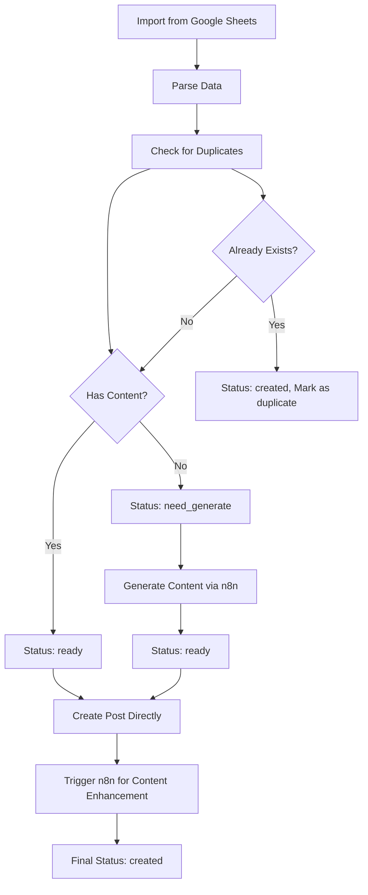

# Post Layout Manager - Enhanced Flow Documentation

## 🚀 Overview

Hệ thống Post Layout Manager đã được nâng cấp để xử lý duplicate detection và integration với n8n webhook cho content generation. System support 2 main flows:

1. **Direct Creation**: Posts có sẵn content → Create ngay lập tức
2. **Generate Then Create**: Posts chỉ có outline → Generate content qua n8n → Create post

## 📋 Features

### ✅ Frontend Features (ReactJS + TypeScript)
- **Duplicate Detection**: Kiểm tra posts đã tồn tại trước khi tạo
- **Smart Status Management**: Auto-detect status dựa trên content availability
- **Bulk Operations**: Generate và Create multiple posts cùng lúc
- **Real-time UI**: Loading states, progress tracking, error handling
- **Edit Modal**: Inline editing của post data trước khi tạo
- **n8n Integration**: Webhook trigger cho content generation

### ✅ Backend Features (C# ASP.NET Core)
- **POST /api/posts/check**: Batch duplicate checking
- **GET /api/posts/check-single**: Single post duplicate check
- **POST /api/posts**: Create post với duplicate prevention
- **Race Condition Protection**: Prevent duplicate creation
- **Performance Optimization**: Indexed queries, batch processing

## 🔄 Enhanced Flow Process



## 🛠 Technical Implementation

### 1. Frontend Service Layer

```typescript
// postLayoutService.ts
class PostLayoutService {
  // New webhook URL
  private n8nWebhookUrl = 'https://ad5244.n8nvps.site/webhook/c4798e99-a3e1-4d6e-9114-459b4d77f1cd';

  // Duplicate checking
  async checkPostsExistence(posts: Array<{outline: string; meta_title: string}>)
  
  // Enhanced import with duplicate detection
  async importFromGoogleSheets(): Promise<PostLayoutData[]>
  
  // Real webhook integration
  async generateContent(data: PostLayoutData): Promise<N8nGenerateResponse>
}
```

### 2. Backend Controller

```csharp
[ApiController]
[Route("api/[controller]")]
public class PostsController : ControllerBase
{
    // Bulk duplicate checking
    [HttpPost("check")]
    public async Task<ActionResult<List<PostExistenceResult>>> CheckPostsExistence([FromBody] CheckPostsRequest request)
    
    // Single post check
    [HttpGet("check-single")]
    public async Task<ActionResult<PostExistenceResult>> CheckSinglePostExistence(string outline, string metaTitle)
    
    // Create with duplicate prevention
    [HttpPost]
    public async Task<ActionResult<CreatePostResponse>> CreatePost([FromBody] CreatePostDto dto)
}
```

### 3. Database Optimization

```sql
-- Indexes for performance
CREATE INDEX IX_Posts_Title_Status ON Posts (Title, Status);
CREATE INDEX IX_Posts_MetaTitle_Status ON Posts (MetaTitle, Status);
CREATE INDEX IX_Posts_Status ON Posts (Status);
CREATE INDEX IX_Posts_CreatedAt ON Posts (CreatedAt);

-- Duplicate checking query
SELECT p.Id, p.Title, p.CreatedAt 
FROM Posts p 
WHERE (p.Title = @MetaTitle OR p.MetaTitle = @MetaTitle)
  AND (p.Body LIKE '%' + @Outline + '%' OR p.Excerpt LIKE '%' + @Outline + '%')
  AND p.Status != 'deleted'
```

## 🎯 Usage Guide

### 1. Import từ Google Sheets
```typescript
// Click "Import from Google Sheets"
// System sẽ:
// 1. Fetch data từ Google Sheets
// 2. Check duplicates với backend
// 3. Set status dựa trên content availability
// 4. Display trong table với badges
```

### 2. Generate Content (Individual)
```typescript
// Click "Generate" button cho items có status 'need_generate'
// System sẽ:
// 1. Call n8n webhook với GET method
// 2. Pass outline, keyword, meta_title qua query params
// 3. Update status thành 'generating' → 'ready'
```

### 3. Bulk Generate Content
```typescript
// Select multiple items → Click "Generate Selected"
// System sẽ:
// 1. Filter chỉ items có status 'need_generate'
// 2. Process sequentially để tránh overwhelm API
// 3. Show progress và results
```

### 4. Create Posts
```typescript
// Click "Create Post" hoặc "Create Selected"
// System sẽ:
// 1. Skip duplicate items tự động
// 2. Validate data trước khi create
// 3. Create post as draft
// 4. Trigger n8n cho content enhancement
```

## 🔧 Configuration

### Environment Variables (.env)
```bash
# Google Sheets API
VITE_GOOGLE_SHEETS_API_URL=https://sheets.googleapis.com/v4/spreadsheets
VITE_GOOGLE_SHEETS_API_KEY=your_api_key
VITE_GOOGLE_SHEET_ID=your_sheet_id
VITE_GOOGLE_SHEET_RANGE=Post1!A2:F1000

# Backend API
VITE_API_URL=http://192.168.10.47:5000/api

# n8n Webhook (Fixed URL)
# VITE_N8N_WEBHOOK_URL=https://ad5244.n8nvps.site/webhook/c4798e99-a3e1-4d6e-9114-459b4d77f1cd
```

### Backend Configuration (appsettings.json)
```json
{
  "ConnectionStrings": {
    "DefaultConnection": "Server=(localdb)\\mssqllocaldb;Database=ReviewUS_CMS;Trusted_Connection=true;MultipleActiveResultSets=true"
  },
  "AllowedHosts": "*",
  "Cors": {
    "AllowedOrigins": ["http://localhost:3000", "http://localhost:5173"]
  }
}
```

## 🛡 Security & Performance

### Security Measures
1. **Input Validation**: Comprehensive validation cho tất cả inputs
2. **SQL Injection Prevention**: Parameterized queries với Entity Framework
3. **Rate Limiting**: Sequential processing để tránh API abuse
4. **CORS Configuration**: Restricted origins cho production
5. **Error Handling**: Detailed logging không expose sensitive data

### Performance Optimizations
1. **Database Indexes**: Optimized cho duplicate checking queries
2. **Batch Processing**: Bulk operations cho efficiency
3. **Connection Pooling**: Entity Framework connection management
4. **Caching Strategy**: Frontend caching cho static data
5. **Sequential API Calls**: Prevent overwhelming external APIs

### Error Handling & Resilience
1. **Graceful Degradation**: Fallback to mock data if APIs fail
2. **Retry Logic**: Built-in retry cho network failures
3. **User Feedback**: Clear error messages và loading states
4. **Race Condition Prevention**: Database constraints và validation
5. **Transaction Management**: Atomic operations cho data consistency

## 🔍 Monitoring & Debugging

### Frontend Debugging
- Console logs cho tất cả API calls
- Error boundaries cho component crashes
- Toast notifications cho user feedback
- Development tools integration

### Backend Logging
- Structured logging với Microsoft.Extensions.Logging
- Error tracking với exception details
- Performance monitoring cho database queries
- API request/response logging

## 📈 Future Enhancements

### Planned Features
1. **Real-time Updates**: WebSocket cho live status updates
2. **Content Preview**: Rich text preview trước khi create
3. **Scheduling**: Schedule post creation cho specific times
4. **Template System**: Reusable templates cho different post types
5. **Analytics Integration**: Track creation success rates và performance metrics

### Scalability Considerations
1. **Background Jobs**: Move heavy processing to background tasks
2. **Microservices**: Split thành separate services cho scalability
3. **CDN Integration**: Asset optimization và delivery
4. **Load Balancing**: Multiple backend instances
5. **Database Sharding**: Horizontal scaling cho large datasets

---

## 🚀 Getting Started

1. **Clone repository**
2. **Setup environment variables** trong .env file
3. **Install dependencies**: `npm install`
4. **Start development server**: `npm run dev`
5. **Setup backend** với PostsController.cs và ApplicationDbContext.cs
6. **Configure database** với proper indexes
7. **Test workflow** từ import → generate → create

Happy coding! 🎉