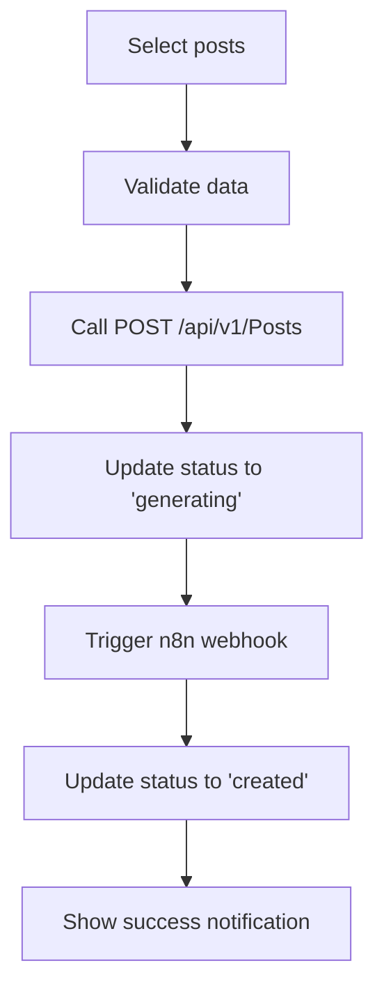
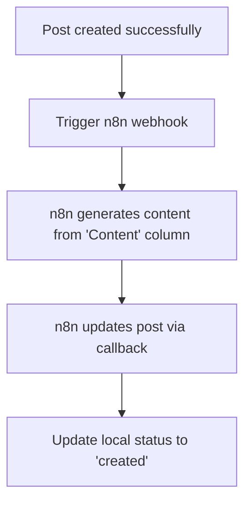

# Post Layout Manager

Một trang quản lý bài viết trong Admin Dashboard cho phép import layout từ Google Sheets và tạo bài viết hàng loạt hoặc từng bài riêng lẻ.

## 🎯 Tính năng chính

### 1. Import từ Google Sheets
- Kết nối và import dữ liệu từ Google Sheets API
- Mapping dữ liệu: outline, meta_title, meta_description, keyword, status
- Preview và validate dữ liệu trước khi import
- Hiển thị thống kê import (total, pending, ready, created, generating, error)

### 2. Quản lý Post Layout
- **Filter & Search**: Tìm kiếm theo title, keyword, outline và filter theo status
- **Pagination**: Phân trang với navigation
- **Bulk Selection**: Chọn tất cả hoặc từng item riêng lẻ
- **Status Management**: Theo dõi trạng thái (pending → ready → generating → created/error)

### 3. Tạo bài viết
- **Individual Creation**: Tạo từng bài riêng lẻ
- **Bulk Creation**: Tạo nhiều bài cùng lúc với progress tracking
- **API Integration**: Gọi API POST `/api/v1/Posts` để tạo Draft posts
- **n8n Integration**: Trigger workflow để generate nội dung từ cột "Content"

### 4. UI/UX Features
- **Preview Modal**: Xem trước toàn bộ thông tin của post layout
- **Status Badges**: Hiển thị trạng thái với màu sắc và icon rõ ràng
- **Export CSV**: Xuất dữ liệu ra file CSV
- **Responsive Design**: Tương thích mobile và desktop

## 🏗️ Kiến trúc

```
src/
├── components/posts/
│   └── PostLayoutManager.tsx          # Main UI component
├── hooks/
│   └── usePostLayoutManager.ts        # Custom hook quản lý logic
├── services/
│   └── postLayoutService.ts           # Service layer cho API calls
├── types/
│   └── postLayout.types.ts            # TypeScript definitions
└── pages/posts/
    └── PostLayoutManagerPage.tsx      # Page wrapper
```

### Component Architecture

**PostLayoutManager** (Main Component)
- Sử dụng `usePostLayoutManager` hook
- UI components: Stats cards, action buttons, data table, pagination, preview modal
- Responsive layout với Tailwind CSS

**usePostLayoutManager** (Custom Hook)
- State management cho toàn bộ functionality
- Business logic và data processing
- API integration thông qua service layer

**postLayoutService** (Service Layer)
- API calls cho Google Sheets, Posts API, n8n webhook
- Data validation và transformation
- Export functionality

## 📋 Flow hoạt động

### 1. Import Phase
```mermaid
graph TD
    A[User clicks Import] --> B[Call Google Sheets API]
    B --> C[Transform data to PostLayoutData[]]
    C --> D[Validate imported data]
    D --> E[Display in table with stats]
```

### 2. Post Creation Phase


### 3. n8n Integration Phase


## 🔧 Configuration

### Environment Variables
```env
# API Configuration
VITE_API_URL=http://localhost:5000
VITE_GOOGLE_SHEETS_API_URL=https://sheets.googleapis.com/v4
VITE_N8N_WEBHOOK_URL=https://your-n8n-instance.com

# Google Sheets API
VITE_GOOGLE_SHEETS_API_KEY=your_api_key
VITE_GOOGLE_SHEETS_CLIENT_ID=your_client_id
```

### Google Sheets Format
Cấu trúc cột trong Google Sheets:
```
A: outline          (string) - Nội dung chính của bài viết
B: meta_title       (string) - SEO title
C: meta_description (string) - SEO description  
D: keyword          (string) - Focus keyword
E: status           (string) - 'ready' hoặc 'pending'
F: content          (string) - Nội dung chi tiết cho n8n generate
```

## 📦 Dependencies

### Core Dependencies
```json
{
  "react": "^18.0.0",
  "typescript": "^5.0.0",
  "tailwindcss": "^3.0.0",
  "lucide-react": "^0.263.0",
  "react-hot-toast": "^2.4.0"
}
```

### Installation
```bash
npm install lucide-react react-hot-toast
```

## 🚀 Usage

### 1. Import vào Router
```tsx
// App.tsx hoặc Router setup
import PostLayoutManagerPage from './pages/posts/PostLayoutManagerPage';

// Add route
<Route path="/admin/posts/layouts" element={<PostLayoutManagerPage />} />
```

### 2. Basic Usage
```tsx
import PostLayoutManager from './components/posts/PostLayoutManager';

function AdminDashboard() {
  return (
    <div className="admin-dashboard">
      <PostLayoutManager />
    </div>
  );
}
```

### 3. Custom Hook Usage
```tsx
import { usePostLayoutManager } from './hooks/usePostLayoutManager';

function CustomComponent() {
  const {
    layoutData,
    stats,
    handleImportFromSheets,
    handleBulkCreate,
    exportData
  } = usePostLayoutManager(20); // 20 items per page
  
  return (
    // Your custom UI
  );
}
```

## 🔌 API Integration

### Posts API
```typescript
// Create post request
POST /api/v1/Posts
{
  "title": "string",
  "slug": "string", 
  "meta_description": "string",
  "keyword": "string",
  "content": "string",
  "status": "draft",
  "seo": {
    "meta_title": "string",
    "meta_description": "string", 
    "focus_keyword": "string"
  }
}
```

### n8n Webhook
```typescript
// Content generation trigger
POST https://your-n8n-instance.com/webhook/generate-content
{
  "post_id": "string",
  "outline": "string", 
  "keyword": "string",
  "meta_title": "string",
  "content_source": "string",
  "webhook_url": "string" // callback URL
}
```

## 🎨 Customization

### Styling với Tailwind
Component sử dụng Tailwind CSS classes, có thể customize:

```tsx
// Custom color scheme
const customColors = {
  primary: 'bg-blue-600 hover:bg-blue-700',
  success: 'bg-green-600 hover:bg-green-700', 
  warning: 'bg-yellow-600 hover:bg-yellow-700',
  danger: 'bg-red-600 hover:bg-red-700',
};
```

### Custom Status Badge
```tsx
const CustomStatusBadge = ({ status }: { status: string }) => {
  const statusConfig = {
    ready: { color: 'bg-blue-500', text: 'Sẵn sàng' },
    generating: { color: 'bg-purple-500', text: 'Đang tạo' },
    // ...custom configs
  };
  // Custom implementation
};
```

## 🐛 Troubleshooting

### Common Issues

1. **Google Sheets API không hoạt động**
   ```bash
   # Check credentials
   echo $VITE_GOOGLE_SHEETS_API_KEY
   
   # Enable Sheets API in Google Console
   # Setup OAuth 2.0 credentials
   ```

2. **n8n webhook timeout**
   ```bash
   # Check n8n instance status
   curl https://your-n8n-instance.com/healthcheck
   
   # Verify webhook URL
   # Check network connectivity
   ```

3. **Posts API 401 Unauthorized**
   ```bash
   # Check JWT token in localStorage
   localStorage.getItem('access_token')
   
   # Verify API endpoint
   # Check CORS configuration
   ```

## 🔄 Development Mode

Trong development mode, component sử dụng mock data:

```typescript
// Mock Google Sheets import
const mockData = await postLayoutService.mockImportFromGoogleSheets();

// Mock n8n trigger
const mockResult = await postLayoutService.mockTriggerContentGeneration(item, postId);
```

## 📈 Performance

- **Pagination**: Giới hạn 10 items per page by default
- **Debounced Search**: Search input có debounce 300ms
- **Lazy Loading**: Chỉ render items trong current page
- **Memoized Calculations**: Sử dụng useMemo cho filtered data

## 🔐 Security

- **Input Validation**: Validate tất cả user inputs
- **API Authentication**: JWT tokens cho API calls
- **XSS Protection**: Sanitize HTML content
- **CORS**: Proper CORS configuration

## 🚀 Production Deployment

1. **Build optimization**:
```bash
npm run build
```

2. **Environment setup**:
```bash
# Production environment variables
VITE_API_URL=https://api.yoursite.com
VITE_GOOGLE_SHEETS_API_URL=https://sheets.googleapis.com/v4
VITE_N8N_WEBHOOK_URL=https://n8n.yoursite.com
```

3. **Performance monitoring**:
- Monitor API response times
- Track n8n webhook success rate
- Monitor memory usage for large datasets

## 📝 Notes

- Component được thiết kế mobile-first với Tailwind CSS
- Tất cả text được thiết kế sẵn cho i18n localization
- Error handling comprehensive với user-friendly messages
- TypeScript strict mode enabled cho type safety